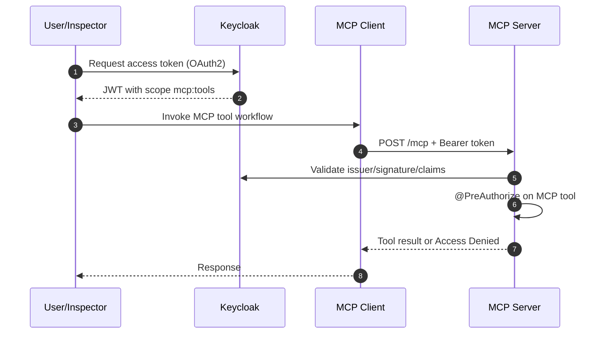

# Medium Article Architecture Plan

## Working Title Options
1. **From Zero to Secure MCP: Integrating Keycloak with Spring AI MCP Server & Client**
2. **Secure Tool Calls in MCP with Keycloak, OAuth2, and Spring AI**
3. **MCP + Keycloak in Practice: AuthN/AuthZ for AI Tooling End-to-End**

## 1) Reader-First Positioning

### Target Audience
- Engineers exploring **Model Context Protocol (MCP)** in production-like setups.
- Developers familiar with Spring Boot/OAuth2 who want a practical MCP security example.
- AI application builders who want to understand **token-based access to MCP tools**.

### Promise of the article
By the end, readers should understand:
- Why MCP needs authentication and authorization.
- How Keycloak issues tokens and scopes for MCP interactions.
- How the server enforces permissions at tool level.
- How a client obtains/forwards tokens when invoking MCP tools.

## 2) Narrative Flow (Recommended Story Arc)

1. **Problem statement (real-world):**
   “MCP lets AI clients call tools, but who is allowed to call what?”
2. **Mental model:**
   Introduce 4 actors: User, Keycloak, MCP Client, MCP Server.
3. **Architecture walkthrough:**
   One end-to-end request from login → token → tool call → authorization check.
4. **Implementation deep dive:**
   Explain exactly how this repository wires security in server and client.
5. **Live verification with MCP Inspector:**
   Show admin success and user denial.
6. **Production notes:**
   Hardening, token lifetimes, CORS, least privilege, observability.

## 3) Proposed Section-by-Section Outline

### Section A — Why secure MCP tool access?
- Explain risk: unrestricted tool execution.
- Clarify AuthN vs AuthZ in MCP context.
- Keep this short and visual.

### Section B — Architecture at a glance
- Insert a high-level diagram (see Diagram 1).
- Explain trust boundaries and token flow.

### Section C — Keycloak setup and scope design
- Realm, client, roles, client scope (`mcp:tools`), audience mapping.
- Why scope-based authorization is used in the server tools.

### Section D — MCP server security implementation (Spring AI)
- Explain `McpServerOAuth2Configurer` usage.
- Explain method-level constraints with `@PreAuthorize("hasAuthority('SCOPE_mcp:tools')")`.
- Explain why this is effective for per-tool permissioning.

### Section E — MCP client integration
- OAuth2 client setup.
- `AuthenticationMcpTransportContextProvider` + request customizer flow.
- How access tokens are attached to MCP HTTP calls.

### Section F — End-to-end verification with MCP Inspector
- Run through token generation and direct MCP invocation.
- Show successful admin call and denied user call.

### Section G — Production-grade recommendations
- Replace wildcard CORS.
- Short access token + refresh strategy.
- Separate scopes by tool domain.
- Add auditing and denial telemetry.

### Section H — Closing
- Key takeaways in 4 bullets.
- Link to repository + suggest next experiments.

## 4) Visual Assets Plan (Images to include)

### Diagram 1: End-to-end Auth Flow (must-have)
Use this in the first half of the article.

### Diagram 2: Component Architecture (must-have)
Show where each module from this repo sits.
- Box: `client/` Spring app
- Box: `server/` MCP tool server
- Box: Keycloak realm/client/scopes
- Arrows: OAuth2 token issuance + MCP HTTP invocation

### Image 3: Keycloak Client Scope + Mapper screen (recommended)
- Show `mcp:tools` scope and audience mapper.

### Image 4: MCP Inspector connected to `/mcp` (recommended)
- Show auth header setup and successful tool invocation.

### Image 5: Access denied example (optional)
- Same tool call with insufficient permissions.

## 5) “Explain Like I’m New” Patterns to keep it intuitive

- Introduce terms with one-line definitions before details.
- Use one concrete running example: `get_current_weather`.
- Prefer “request journey” explanations over framework jargon.
- Include mini “Why this matters” callouts after each technical block.
- Add a “Common mistakes” box near the end.

## 6) Mapping Article Claims to This Repository

Use these code anchors in the article when referencing implementation:
- Server OAuth2 integration and auth server binding:
  - `server/src/main/java/spring/ai/mcp/server/configuration/McpSecurityConfiguration.java`
- Tool-level scope enforcement:
  - `server/src/main/java/spring/ai/mcp/server/mcp_tools/McpTools.java`
- Client-side MCP OAuth2 token propagation:
  - `client/src/main/java/spring/ai/mcp/client/configuration/McpConfiguration.java`
- Client OAuth2 enablement:
  - `client/src/main/java/spring/ai/mcp/client/configuration/SecurityConfiguration.java`
- Setup and verification walkthrough:
  - `README.md`

## 7) Suggested Writing Ratio (for Medium readability)

- 20% concepts and architecture.
- 50% guided walkthrough with screenshots.
- 20% implementation snippets with explanations.
- 10% production hardening + conclusion.

## 8) Optional Two-Part Version

If article becomes long, split into:
1. Part 1: Architecture + Keycloak + server protection.
2. Part 2: Client integration + inspector validation + production hardening.

---

## Next Step After This Plan
Create the full draft using this architecture, including:
- polished intro and conclusion,
- copy-paste-ready code snippets,
- final diagram images (PNG/SVG),
- screenshot placement captions.
