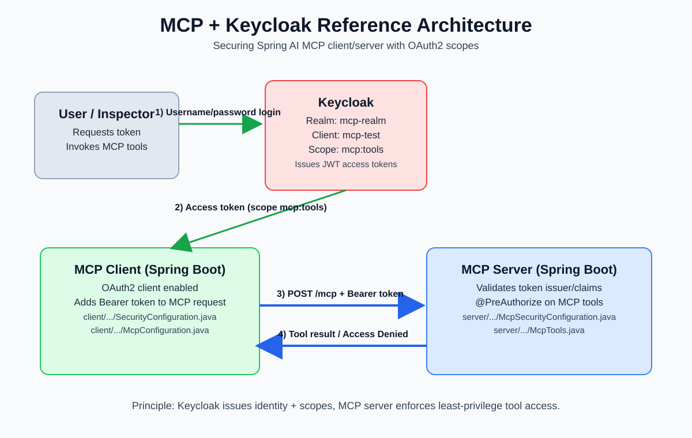
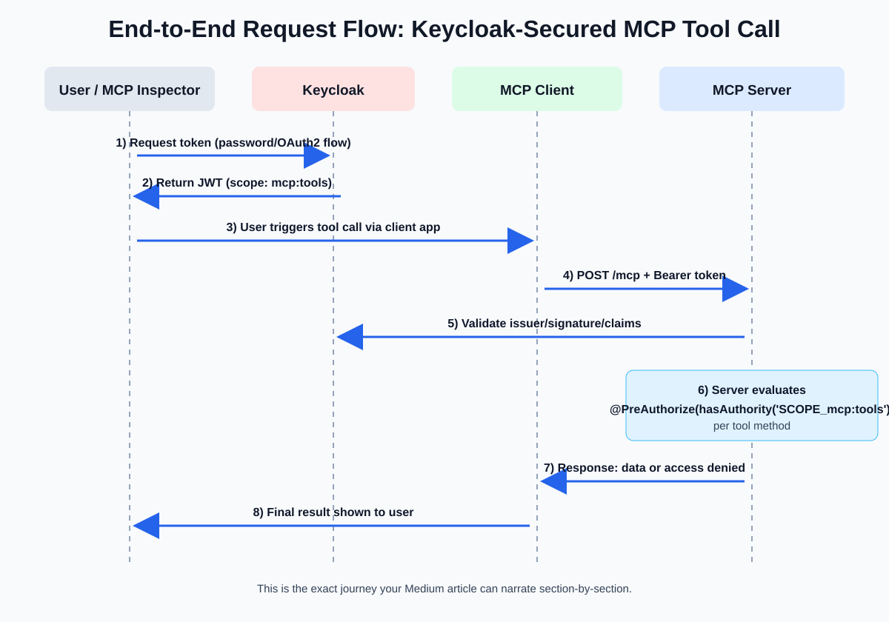

# Secure MCP End-to-End with Keycloak, OAuth2, and Spring AI (Client + Server)

> **Subtitle:** A practical, detailed, and intuitive guide to add authentication + authorization to MCP tools.

If you are building with MCP (Model Context Protocol), one production question appears quickly:

**Who is allowed to call which MCP tool?**

This repository shows a complete answer with:
- **Keycloak** as the Identity Provider (IdP),
- a **Spring AI MCP Server** exposing tools,
- a **Spring AI MCP Client** consuming tools,
- **scope-based authorization** (`mcp:tools`) enforced at tool method level.

This article goes from architecture to exact setup to validation, with visuals and copy-paste commands.

---

## What you will build (mental model first)

At the end of this walkthrough, the behavior is:

- A user authenticates against Keycloak and receives an access token.
- The token includes scopes (for example `mcp:tools`) based on Keycloak role/scope mapping.
- MCP client (or MCP Inspector) calls the MCP server with this bearer token.
- MCP server validates token issuer/claims and enforces `@PreAuthorize` before executing tools.
- Users without required scope get `Access Denied` even if they are authenticated.

That last point is the heart of AuthZ in MCP systems.

---

## Architecture overview



### Component responsibilities

- **Keycloak**
  - Hosts realm (`mcp-realm`), client (`mcp-test`), users, roles, and client scopes.
  - Issues short-lived access tokens.
- **MCP Server (port 9090)**
  - Exposes `/mcp` endpoint and MCP tools.
  - Verifies JWT using Keycloak issuer URI.
  - Applies method-level scope checks via Spring Security.
- **MCP Client (port 9091)**
  - OAuth2 client-enabled.
  - Adds auth context/token to outgoing MCP requests.
- **MCP Inspector (optional but recommended)**
  - Great for manual testing and screenshots.

---

## End-to-end request flow



### How to narrate this flow in your Medium post

1. User logs in (or requests token) at Keycloak.
2. Keycloak returns JWT with scopes.
3. User triggers MCP call (via client or inspector).
4. Request hits `POST /mcp` with bearer token.
5. Server validates issuer/signature/claims.
6. Server evaluates `@PreAuthorize("hasAuthority('SCOPE_mcp:tools')")` on tool.
7. Response is either tool output or access denied.

Keep repeating this simple sentence:

> **Authentication gets you in; authorization decides what you can do.**

---

## Prerequisites

- Java 21
- Node.js (for MCP Inspector)
- Keycloak installed locally
- This repository cloned

---

## Step 1 — Start Keycloak and create the security model

Run Keycloak:

```bash
kc start-dev
```

Open: `http://localhost:8080`

### Create realm

- Realm name: `mcp-realm`

### Create client

- Client ID: `mcp-test`
- Enable direct access grants
- Use URLs (for inspector testing):
  - Root URL: `http://localhost:6274`
  - Home URL: `http://localhost:6274/`
  - Valid Redirect URIs: `http://localhost:6274/*`
  - Web Origins: `http://localhost:6274/*`

### Create client roles

Inside client `mcp-test`:
- `admin_role`
- `user_role`

### Configure trusted host

In client registration trusted hosts, add:
- `http://localhost:6274`

### Create the client scope used by MCP tools

- Scope name: `mcp:tools`
- Type: Optional
- Include in token scope: enabled

### Add audience mapper to that scope

Inside scope `mcp:tools` > Mappers:
- Add mapper → Audience
- Name example: `MCP Tools Audience`
- Include custom audience: `http://localhost:9090/mcp`
- Enable add to access token + token introspection

### Bind role to scope

Inside scope `mcp:tools` > Scope:
- Assign role → Client roles → choose `admin_role`

### Create users

Create at least two users:

1. `admin` (assign `admin_role`)
2. `user` (assign only `user_role`)

Set passwords and disable temporary password flag.

---

## Step 2 — Start MCP server and MCP client apps

From project root, run in separate terminals:

```bash
./gradlew :server:bootRun
```

```bash
./gradlew :client:bootRun
```

### Important runtime values from this repo

#### Server (`server/src/main/resources/application.properties`)
- Runs on `9090`
- JWT issuer: `http://localhost:8080/realms/mcp-realm`
- MCP server enabled and protocol set to `STREAMABLE`

#### Client (`client/src/main/resources/application.properties`)
- Runs on `9091`
- MCP server connection URL: `http://localhost:9090`
- OAuth2 provider issuer uses same Keycloak realm
- Client registration id: `authserver`
- Scopes include `openid,mcp:tools,offline_access`

---

## Step 3 — Get an access token for admin

Use password grant for quick testing:

```bash
curl --location 'http://localhost:8080/realms/mcp-realm/protocol/openid-connect/token' \
--header 'Content-Type: application/x-www-form-urlencoded' \
--data-urlencode 'client_id=mcp-test' \
--data-urlencode 'grant_type=password' \
--data-urlencode 'username=admin' \
--data-urlencode 'password=admin' \
--data-urlencode 'scope=profile email mcp:tools'
```

Expected shape:

```json
{
  "access_token": "...",
  "expires_in": 300,
  "refresh_expires_in": 1800,
  "refresh_token": "...",
  "token_type": "Bearer",
  "scope": "..."
}
```

> Access token expires in 5 minutes (`300s`), so refresh/recreate if call fails later.

---

## Step 4 — Validate using MCP Inspector

Launch inspector (repository README notes this compatible version):

```bash
npx @modelcontextprotocol/inspector@0.17.2
```

Why this version? It matches the MCP protocol generation used during this project’s development.

### Inspector settings

- Transport Type: `Streamable HTTP`
- URL: `http://localhost:9090/mcp`
- Connection Type: `Direct`
- Authentication > Custom headers:
  - Header: `Authorization`
  - Value: `Bearer <access_token>`

Then:
1. Click **Connect**
2. Go to **Tools**
3. Click **List Tools**
4. Select a protected tool (e.g. weather tool)
5. Run with sample region

### What you should see

- With `admin` token (has `mcp:tools`) → success
- With `user` token (no mapped scope) → `Access Denied`

This comparison is your most powerful “aha moment” for readers.

---

## Deep dive: where security is implemented in code

## 1) Server-side OAuth2 + MCP integration

In server security config, MCP OAuth2 support is enabled and bound to issuer:

```java
.with(
    McpServerOAuth2Configurer.mcpServerOAuth2(),
    (mcpAuthorization) -> {
        mcpAuthorization.authorizationServer(this.issuerUrl);
    }
)
```

The server also configures CORS and security filter chain around MCP endpoint handling.

## 2) Tool-level authorization

Each tool method is guarded like this:

```java
@PreAuthorize("hasAuthority('SCOPE_mcp:tools')")
@McpTool(description="returns the current temperature of the region in celsius")
public float get_current_weather(String region) {
    return 17.0F;
}
```

And similarly for weather history tool.

This means authorization is attached to capability (tool) rather than only URL.

## 3) Client-side token propagation

Client enables OAuth2 and wires MCP auth context propagation:

```java
.oauth2Client(Customizer.withDefaults())
```

```java
syncSpec.transportContextProvider(
    new AuthenticationMcpTransportContextProvider()
);

return new OAuth2AuthorizationCodeSyncHttpRequestCustomizer(
    clientManager,
    "authserver"
);
```

So outgoing MCP requests automatically carry OAuth2 identity context.

---

## Why this pattern is good for real projects

- **Least privilege:** only scoped users invoke scoped tools.
- **Centralized identity:** Keycloak handles users/roles/sessions.
- **Tool-level policy:** clear security near business function.
- **Auditable flow:** auth failures can be tracked per tool call.
- **Scalable design:** add granular scopes as tool count grows.

---

## Recommended section flow for your Medium article

If you publish this as a post, use this order for strong readability:

1. Problem in one paragraph (“who can call tools?”)
2. Architecture image
3. Request flow image
4. Quickstart setup (Keycloak + run apps + token)
5. Inspector demo (success vs denied)
6. Code deep dive (server + tool + client)
7. Hardening checklist
8. Conclusion and next steps

---

## Production hardening checklist

Before production, improve these items:

1. Replace wildcard CORS with explicit allowed origins.
2. Tune access-token TTL + refresh policy based on risk.
3. Move from single scope (`mcp:tools`) to fine-grained scopes:
   - `mcp:weather:read`
   - `mcp:weather:history`
   - `mcp:admin:*`
4. Add structured audit logs for tool execution and denial reasons.
5. Add rate limits on MCP endpoint and upstream gateway.
6. Add monitoring/alerts for repeated auth failures.
7. Review Keycloak realm/client backup and disaster recovery.

---

## Troubleshooting guide (useful for readers)

### Error: Access denied
- Check token has `mcp:tools` in scope.
- Check user is assigned proper role in client role mapping.
- Check role is mapped into `mcp:tools` client scope.

### Error: token invalid/issuer mismatch
- Confirm server issuer URI exactly matches realm issuer URL.
- Confirm realm name in token URL and app config are same.

### Inspector connects but tool invocation fails
- Verify Authorization header is set as `Bearer <token>`.
- Verify token is not expired (remember 5-minute TTL in sample).
- Retry with fresh token.

### Works locally, fails in deployment
- Revisit CORS and trusted hosts.
- Verify audience and redirect URI values for deployed domains.

---

## Conclusion

This repository demonstrates an excellent baseline for securing MCP:

- Keycloak handles identity and token minting.
- Spring AI MCP server validates JWT and enforces scope at tool level.
- Spring AI MCP client forwards OAuth2 context cleanly.
- Inspector gives a fast feedback loop for verification.

If your Medium article emphasizes:
- the two architecture visuals,
- one successful admin call,
- one denied user call,

…readers will understand both implementation and security design immediately.

---

## Reference anchors in this repository

- Setup walkthrough:
  - `README.md`
- Server security config:
  - `server/src/main/java/spring/ai/mcp/server/configuration/McpSecurityConfiguration.java`
- MCP tools with authorization:
  - `server/src/main/java/spring/ai/mcp/server/mcp_tools/McpTools.java`
- Client MCP auth propagation:
  - `client/src/main/java/spring/ai/mcp/client/configuration/McpConfiguration.java`
- Client security enablement:
  - `client/src/main/java/spring/ai/mcp/client/configuration/SecurityConfiguration.java`
- Server runtime settings:
  - `server/src/main/resources/application.properties`
- Client runtime settings:
  - `client/src/main/resources/application.properties`
